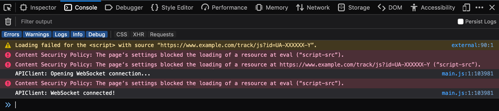
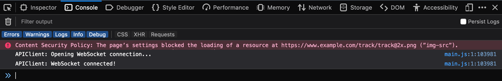

Layout
======

Use this screen to edit the layout displayed in external interface. The layout management screen is available in the *Layout* module of the *External Interface* group.

.. figure:: images/layout.png
   :alt: Edit Layout Screen

   Edit Layout Screen

A fresh OTRS installation already contains a default layout. In this screen all parameters can be changed.

.. warning::

   Make sure to save your changes when you finish. The new configuration will be immediately deployed.

Logo
   The logo is a small image that is displayed in the top left corner of the external pages.

   To change the logo, click on the *Select image to upload* button, and select a new logo image. Recommended file format is PNG.

Favicon
   The `favorite icon <https://en.wikipedia.org/wiki/Favicon>`_ is an icon that is displayed in the URL bar of the web browser.

   To change the favorite icon, click on the *Select image to upload* button, and select a new icon. This is usually a 16×16 pixel image in PNG or ICO format.

Primary Color
   Primary color is the most important color of the external pages (see the preview screen).

   To change the primary color, just select a new color from the color palette. You can chose from the pre-selected colors or define other colors by choosing it from the color selector or typing the hexadecimal value. The new color will be displayed in the preview widget immediately.

Highlight Color
   Highlight color is the second color of the external pages using for status badges, links, etc.

   To change the highlight color, just select a new color from the color palette. You can chose from the pre-selected colors or define other colors by choosing it from the color selector or typing the hexadecimal value. The new color will be displayed in the preview widget immediately.

Default Avatar
   Will be used as the default avatar for all outgoing communication.

   To change the avatar, click on the *Select image to upload* button, and select a new avatar image.

Custom CSS
   Use this text area to add custom CSS to be applied in the external interface.

   .. figure:: images/layout-custom-css.png
      :alt: Custom CSS Widget

      Custom CSS Widget

Include Custom Scripts
----------------------

External interface application has been built with security-first mindset in place. It contains several mechanisms to make sure that all code in the front end is provided directly by the OTRS framework.

In addition, a security standard called `Content Security Policy <https://en.wikipedia.org/wiki/Content_Security_Policy>`__ headers is now leveraged by the built-in web server. It serves as a last line of defense and in case some unexpected code still makes it to the client, it will make sure that the user’s browser simply refuses to run it.

However, a use-case still exists in which even a modern web application might still need to run some additional code, provided it is vetted and included by the administrators. One example could be an external integrated chat solution, but could also be an inline code snippet used for external web analytics.

.. seealso::

   Including custom scripts can be done in the :doc:`../administration/system-configuration` with the following settings:

   - ``ExternalFrontend::ExternalScripts``
   - ``ExternalFrontend::InlineScripts``
   - ``WebApp::Server::AdditionalOrigins``

Web Analytics Example
~~~~~~~~~~~~~~~~~~~~~

In this example, we outline the steps to include custom scripts used by a web analytics provider in the external interface application. They will be run each time the application is used in order to track and report the behavior of the user for later analysis.

We start with the provided code snippet below, from a third party provider.

.. code-block:: html

   
   

First line of the snippet refers to an *external* resource which should be loaded by the ``script`` tag.

In the script block below, we have some *inline* code which is run immediately when the page is loaded.

Adding External Script Resources
^^^^^^^^^^^^^^^^^^^^^^^^^^^^^^^^

First, we need to include the external script location in the appropriate configuration:

1. Go to the *System Configuration* screen.
2. Search for the setting ``ExternalFrontend::ExternalScripts``.
3. Click on the setting in order to edit it.
4. In case a value is already present, click on the plus button. Otherwise, proceed below.
5. Enter the full location of the *external* resource in the text field. For example: ``https://www.example.com/track/js?id=UA-XXXXXX-Y``.
6. Click on the check mark in order to save the modified setting.
7. Deploy the modified system configuration.

Adding Inline Code Snippets
^^^^^^^^^^^^^^^^^^^^^^^^^^^

Next, we have to also include the inline part of the original snippet:

1. Go to the *System Configuration* screen.
2. Search for the setting ``ExternalFrontend::InlineScripts``.
3. Click on the setting in order to edit it.
4. In case a value is already present, click on the plus button. Otherwise, proceed below.
5. Enter the full code snippet in the text area, minus any ``script`` tags. For example:

   .. code-block:: javascript

      window.dataLayer = window.dataLayer || [];
      function track(){dataLayer.push(arguments);}
      track('js', new Date());

      track('config', 'UA-XXXXXX-Y');

6. Click on the check mark in order to save the modified setting.
7. Deploy the modified system configuration.

Rebuilding the External Interface Application
^^^^^^^^^^^^^^^^^^^^^^^^^^^^^^^^^^^^^^^^^^^^^

In order to apply the changes, we also need to rebuild the external interface application. Drop down to shell, and execute the following command:

.. code-block:: bash

   bin/otrs.WebServer.pl --deploy-assets

Whitelisting Additional Origins in the Security Headers
^^^^^^^^^^^^^^^^^^^^^^^^^^^^^^^^^^^^^^^^^^^^^^^^^^^^^^^

If you now try to access the external interface application, you will be able to verify that the scripts are included in the code. However, your browser will probably block access to all *inline* and *external* resources, therefore the code might fail with some errors.

This behavior is by design, since external resources can only be loaded if they are specifically whitelisted in the *Content Security Policy* headers.

To check for blocked code, please use suitable web browser inspection tools. In our example, we will be using Mozilla Firefox and its web console available via *Tools → Web Developer → Web Console* menu item, or via the *F12* shortcut key.

For the example code snippet, you might receive following errors in the console when the application is accessed:

   Browser Console Errors and Warnings

From the console errors we can see that the external script resource was prevented from being loaded (lines 1 and 3). In addition to that, two evaluation calls were also blocked (lines 2 and 5). All errors reference a *Content Security Policy* rule under the name of ``script-src``, which signals script resources.

We need to add both the external resource and the evaluation calls to the additional origins list of the *Content Security Policy* headers:

1. Go to the *System Configuration* screen.
2. Search for the setting ``WebApp::Server::AdditionalOrigins``.
3. Click on the setting in order to edit it.
4. In case a value for ``script-src`` is already present, click on the plus button next to it. Otherwise, proceed below.
5. Enter the domain part only of the blocked resource in the text field. For example: ``https://www.example.com``. This allows the external resource to be loaded.
6. Click on the plus button next to the field, so another value is added.
7. Enter the following directive in the new field, including the quotes: ``'unsafe-eval'``. This allows the evaluation calls to be executed.
8. Click on the check mark in order to save the modified setting.
9. Deploy the modified system configuration.

There is no need to rebuild the external interface application at this point, as the additional origins configuration should be immediately in effect.

If you reload the external interface application, you might get some additional errors. In our example, it might be the following:

   Additional Browser Console Errors and Warnings

This error points that an additional resource that was also blocked, an image at a specific location (line 1). We can deduce this via the name of the *Content Security Policy* rule ``img-src``, which references an image resource. In order to add it to the whitelist, try the following:

1. Go to the *System Configuration* screen.
2. Search for the setting ``WebApp::Server::AdditionalOrigins``.
3. Click on the setting in order to edit it.
4. In case a value for ``img-src`` is already present, click on the plus button next to it. Otherwise, proceed below.
5. Enter the domain part only of the blocked resource in the text field. For example: ``https://www.example.com``. This allows the external image resource to be loaded.
6. Click on the check mark in order to save the modified setting.
7. Deploy the modified system configuration.

Try again to reload the external interface application and check if there are more errors. If not, your scripts are now probably working as expected.

Unfortunately, it is not possible to predict what kind of resources your scripts might be requiring. But, no worries, you can whitelist most of them, just make sure to follow the trail of hints shown in the browser console log. Find a corresponding header rule in the configuration and update it accordingly.

.. note::

   Some resources might only be requested by others, hence several iterations might be needed until everything is configured properly.

.. warning::

   Whitelisting external resources opens potential security risks in your OTRS application! Only allow those resources that you are sure are not malicious and come from reputable sources. Keep in mind that if something is secure today, does not mean it will be tomorrow. Stay safe!
